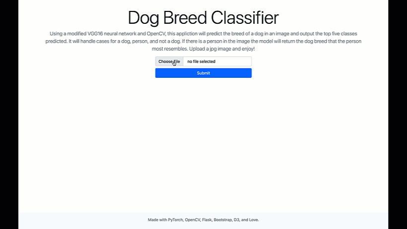
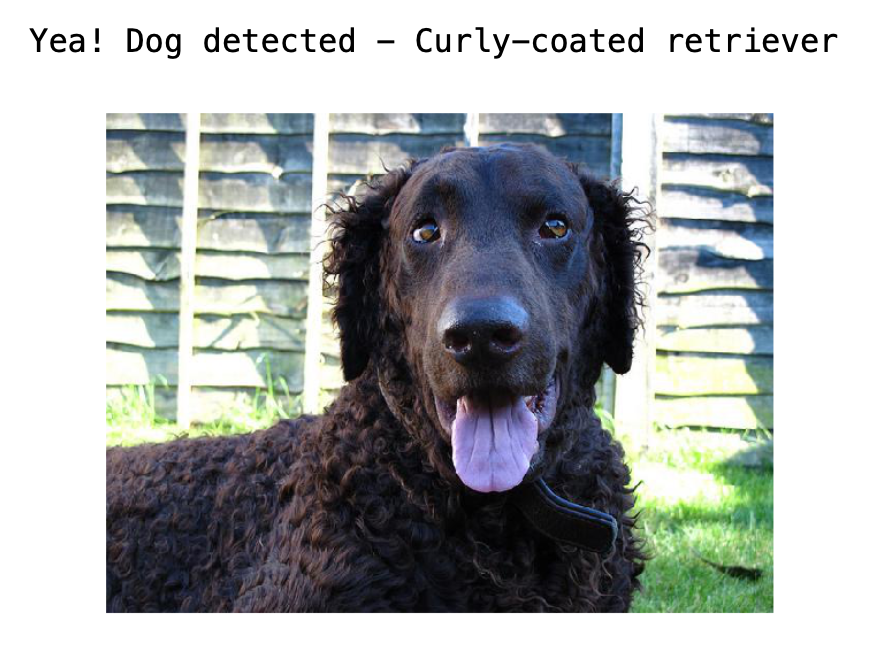
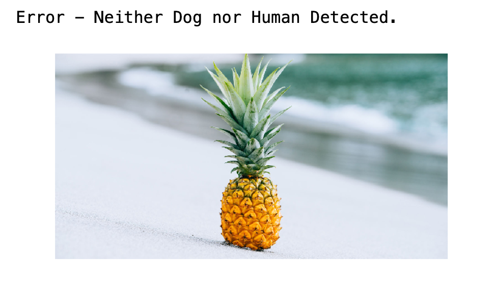
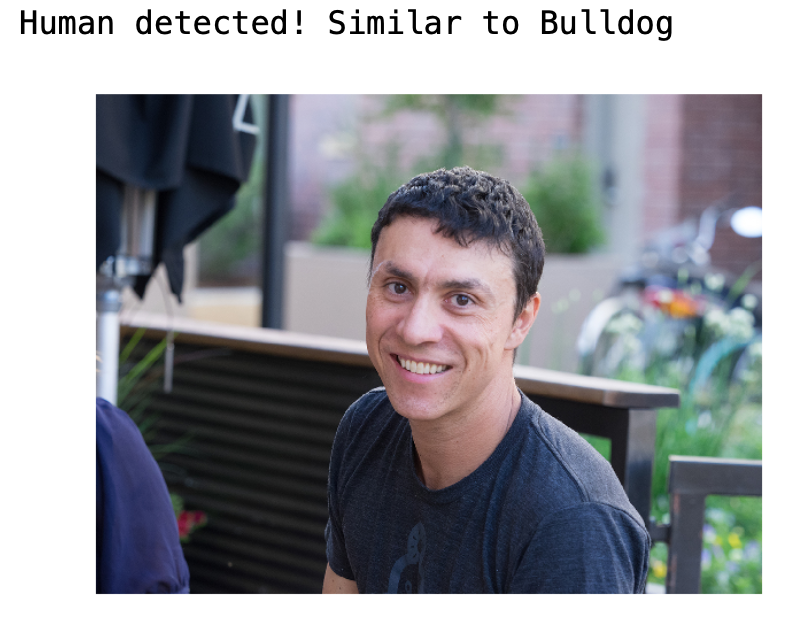
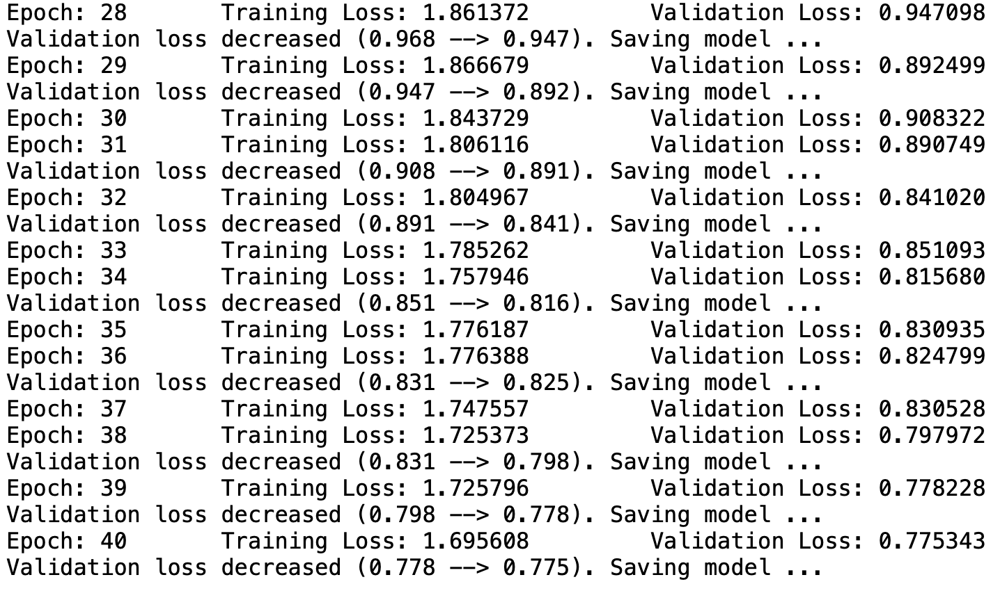

# Dog Breed Classifier Application 
Using a midified VGG16 neural network and OpenCV, this Flask application will predict the breed of the dog with a certain probability and output the topk (k=5) results. The application handles cases for a dog, person, and not a dog. Using a haarcascade alogrithm the app will detect if there is a person in the image, then return the dog breed that the person looks most likely resembles. Enjoy!

### Navigation
* [Installation](#installation)
* [Running the Application](#run_app)
* [CNN Architecture](#arch)
* [Training Your Own Model](#training)

## Installation

1. Install dependencies - I generally use Conda for my environment and package management. 

	>`pip install requirements.txt`

2. Clone this repo -
    >`https://github.com/justinbellucci/app_dog_breed_classifier`  
    `cd app_dog_breed_classifier`
    
3. Main Files - located in `/backend` folder  

    _Dog Breed Classifier_   
    `app.py` - runs the main application  
    `model_functions.py` - loads checkpoint and class names  
    `image_helper.py` - functions to help with image prep  
    `classifier.py` - CNN Classifier class   
    `detectors.py` - human and dog detector functions  
    `predict.py` - prediction functions using VGG16 model and haarcascade algorithm  

    _Training a Model_  
    `train.py` - main function to train the CNN using transfer learning  
    `loaders.py` - pytorch dataloaders and transforms
 

## Running the Application
To run the applcation from the command line simply navigate to the main repo folder and enter the following:

>`python app.py --img_path _my_path.jpg_`

Where _my_path.jpg_ is the path to the image you want to classify. 

## CNN Architecture
This application uses two CNN models for classification purposes, one of which implements a custom classifier. The CNN model was trained on a dataset of over 8000 images.

1. Dog Detector - This function uses a __VGG16__ pretrained model to detect if a dog is in the image. It simply outputs a class then references a class dictionary from Imagenet. VGG16 Imagenet class dictionary keys 151-268, inclusive, correspond to dog names.

2. Transfer Learning - Starting with a pretrained __densenet121__ CNN model a custom multi layer classifier was constructed with 120 output nodes representing the 120 class labels in the dataset. With frozen convolutional layer parameters, the model was trained on a GPU for for around 6 hours over 40 epochs. At the time of stopping the validation loss was still decreasing. The model achieved accuracy of approximatly 79% when evaluated with the test image set. 

## Training Your Own Model
Included is the code to train you own model. You will just need a training, validation and test set of data. The `data_loader()` function in the `loaders.py` file uses the `torchvision.datasets.ImageFolder()` class to load image data. Please take a look at https://pytorch.org/docs/stable/torchvision/datasets.html#imagefolder for specifics about naming conventions. According to the documentation the images should be aranged in this way:

>`root/dog/xxx.png`  
 `root/dog/xxy.png`  
 `root/dog/xxz.png`  
 `root/cat/123.png`  
 `root/cat/nsdf3.png`  
 `root/cat/asd932_.png`  

 It is highly recommended that you use GPU. The code has support for cuda and will check accordingly. From the command line run:

 >`python train.py --chkpt_dir /model_checkpoint.pt --epochs 40 --img_dir /dogimages`

 Make sure that the `/dogimages` folder has the following subfolder naming:
 >`dogimages/train`  
  `dogimages/valid`
  `dogimages/test`

Stay tuned for more additions to this projects! 
